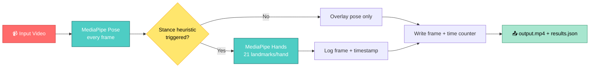

<div align="center">

# 🎯 MotionNet Video Analyzer

**Real-time pose & conditional hand tracking, built on MediaPipe + OpenCV**


</div>

---

## 📖 Overview

MotionNet processes a video frame-by-frame, tracks full-body pose on every frame, and **conditionally** activates hand tracking only when a specific wrist/arm stance pattern is detected — keeping compute low on long footage. Every triggered frame is logged with its timestamp, and the annotated video plus a JSON event report are saved as output.

## 🧩 How It Works



## ✨ Features

| Feature | Detail |
|---|---|
| 🦴 **Full-video pose tracking** | 33-point body landmarks drawn on every frame via `MediaPipe Pose` |
| ⚡ **Conditional hand tracking** | 21-point hand landmarks computed only when the stance heuristic fires — saves compute on frames that don't need it |
| 🎯 **Stance heuristic** | Flags frames where both wrists are forward, raised above hip level, and close together (`is_weapon_stance()` — thresholds are tunable) |
| ⏱️ **Timestamp overlay** | Frame-accurate `MM:SS:ms` counter burned into every output frame |
| 📋 **Event logging** | `results.json` records every triggered frame's number + timestamp |
| 📊 **Run summary** | Console output with total frames, pose detection rate, hand detection count, and event count |

## 🛠️ Requirements

| Dependency | Version |
|---|---|
| Python | 3.8+ |
| mediapipe | 0.10.14 |
| opencv-python-headless | latest |
| numpy | latest |
| gdown | latest *(only if pulling source video from Google Drive)* |

## 🚀 Setup

```bash
pip install mediapipe==0.10.14 opencv-python-headless numpy gdown
```

## ▶️ Usage

1. **Open** `Video_Analyzer.ipynb` in Jupyter or Google Colab.
2. **Provide input video** — point to a local file path, or set your Google Drive file ID for the `gdown` cell to fetch it.
3. **Run all cells.** Live progress (`%` complete) prints as frames process.
4. **Collect outputs** from the working directory:
   - `output.mp4` — original video with pose/hand overlays + timestamp
   - `results.json` — detection stats and full list of triggered events

## 📦 Output Format

```json
{
  "total": 29278,
  "pose": 27850,
  "hands": 412,
  "weapon_events": [
    { "frame": 1503, "time": "00:51:800" }
  ]
}
```

| Field | Meaning |
|---|---|
| `total` | Frames processed |
| `pose` | Frames with a valid pose detection |
| `hands` | Frames where hand tracking ran (stance triggered) |
| `weapon_events` | List of `{frame, time}` for every triggered frame |

## 📁 Project Structure

```
MotionNet-Video-Analyzer/
├── Video_Analyzer.ipynb    # Main notebook — analyzer class + run cell
├── sample/                 # Optional: short demo output clip
├── README.md
└── LICENSE
```

## ⚙️ Tuning

- `model_complexity`, `min_detection_confidence`, `min_tracking_confidence` in `VideoAnalyzer.__init__` — first knobs to adjust for accuracy vs. speed.
- The stance heuristic in `is_weapon_stance()` is a simple geometric rule on wrist/shoulder/hip landmark positions — a starting point for experimentation, not a validated classifier. Treat `weapon_events` as candidates to review manually.

## 📝 Notes

- Developed and tested on 3640×2048 @ 29fps footage; runtime scales with resolution and total frame count, since pose detection runs on every single frame.
- Designed for Colab/Jupyter workflows — no CLI or packaging included.

## 📄 License

MIT — see [`LICENSE`](LICENSE) for details.

---

<div align="center">
<sub>Built with MediaPipe & OpenCV</sub>
</div>
