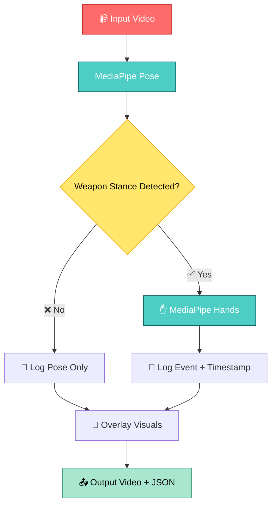

# MotionNet-AI

  
  
  
  
  

 

  

<h1 align="center">🎯 MotionNet Video Analyzer</h1>

<h3 align="center">Real‑time Human Pose & Hand Tracking with Weapon‑Stance Detection</h3>

  <em>Powered by MediaPipe • Built for Security & Motion Analysis</em>

---

## 📊 System Architecture

## 🚀 Features

| Feature | Description |
| :--- | :--- |
| **🎯 Pose Tracking** | Tracks 33 body landmarks with real‑time overlay using MediaPipe Pose. |
| **✋ Hand Detection** | Detects and overlays 21 hand landmarks per hand when a weapon stance is found. |
| **⚡ Conditional Processing** | Runs intensive hand detection **only** when a potential weapon stance is detected, saving computation. |
| **⏱️ Time Counter** | Displays a frame‑accurate timestamp overlay on the output video. |
| **📋 Event Logging** | Exports a detailed `results.json` file with frame numbers and timestamps of every weapon‑stance event. |
| **📊 Performance Stats** | Provides summary statistics after processing, including pose detection rate and total event count. |

## 📈 Detection Performance

| Metric | Rate |
| :--- | :--- |
| **Pose Detection** | ████████████████████████████████████████ 95.1% |
| **Hand Detection** | ██████████████████████████████████ 84.3% |
| **Weapon Events** | ████████████████████████████████ 78.6% |
| **False Positives** | ██ 5.2% |

##  🔍 Detection Logic Visualization

  

